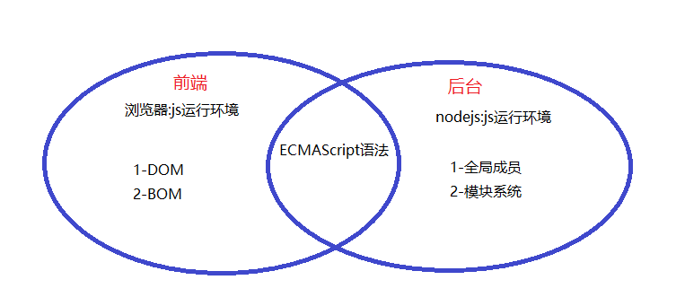
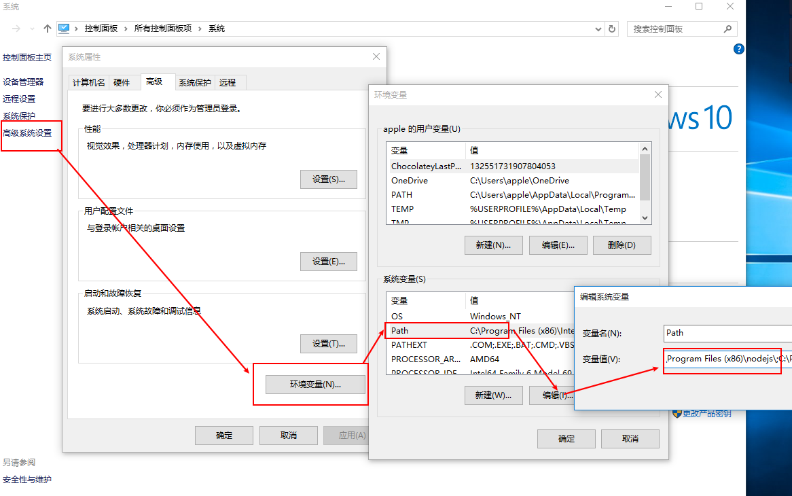

# Nodejs

## 1.Nodejs简介

### 1.1 什么是Nodejs

 Node.js 就是运行在服务端的 JavaScript。

Node.js 在浏览器外运行 V8 JavaScript 引擎（Google Chrome 的内核）。

Node.js是一个Javascript运行环境(runtime environment)，发布于2009年5月，由Ryan Dahl开发，实质是对Chrome V8引擎进行了封装。Node.js对一些特殊用例进行优化，提供替代的API，使得V8在非浏览器环境下运行得更好。

### 1.2 为什么使用 Node.js ?

- Node.js 具有独特的优势，因为为浏览器编写 JavaScript 的数百万前端开发者现在除了客户端代码之外还可以编写服务器端代码，而无需学习完全不同的语言。

- 在 Node.js 中，可以毫无问题地使用新的 ECMAScript 标准，因为不必等待所有用户更新其浏览器，你可以通过更改 Node.js 版本来决定要使用的 ECMAScript 版本，并且还可以通过运行带有标志的 Node.js 来启用特定的实验中的特性。

- 大量的库npm 的简单结构有助于 Node.js 生态系统的激增，现在 npm 仓库托管了超过 1,000,000 个可以自由使用的开源库包。

### 1.3 nodejs与浏览器的区别
- 相同点：nodejs与浏览器都是浏览器的运行环境，都能够解析js程序。对于ECMAScript语法来说，在nodejs和浏览器中都能运行。
- 不同点：nodejs无法使用DOM和BOM的操作，浏览器无法执行nodejs中的文件操作等功能。
- 


## 2.如何安装 Node.js

[官网下载-稳定版](https://nodejs.org/zh-cn/)
[nodejs中文网](http://nodejs.cn/)

## 3.查看安装版本

### 3.1 使用以下命令来查看当前的 Node 版本,建议使用新版本

```bash
$ node -v
```
### 3.2 安装NPM

NPM是随同NodeJS一起安装的包管理工具，能解决NodeJS代码部署上的很多问题，常见的使用场景有以下几种：

- 允许用户从NPM服务器下载别人编写的第三方包到本地使用。
- 允许用户从NPM服务器下载并安装别人编写的命令行程序到本地使用。
- 允许用户将自己编写的包或命令行程序上传到NPM服务器供别人使用。

由于新版的nodejs已经集成了npm，所以之前npm也一并安装好了。同样可以通过输入 **"npm -v"** 来测试是否成功安装。命令如下，出现版本提示表示安装成功:

```bash
$ npm -v
```

### 3.3 安装可能会出现的错误

- 若出现如下错误
  将node.exe所在文件夹配置到PATH系统环境变量中
- 

## 4.Nodejs初体验

### 4.1 从命令行运行 Node.js 脚本

```js
console.log("Hello Nodejs");
```

保存该文件，文件名为mynode.js， 并通过 node命令来执行：

### 4.2 交互模式(REPL)

打开终端，键入node进入命令交互模式，可以输入一条代码语句后立即执行并显示结果，例如：

```
$ node
> console.log('Hello Nodejs');
Hello Nodejs
```

注意:第一个值 `测试` 是告诉控制台要打印的输出，然后得到 `undefined`，它是运行 `console.log()` 的返回值。

现在可以输入一行新的 JavaScript。

### 4.3 如何从 Node.js 程序退出

当在控制台中运行程序时，可以使用 `ctrl-C` 将其关闭，但是这里要讨论的是以编程的方式退出。

`process` 核心模块提供了一种便利的方法，可以以编程的方式退出 Node.js 程序：`process.exit()`。

当 Node.js 运行此行代码时，进程会被立即强制终止。

这意味着任何待处理的回调、仍在发送中的任何网络请求、任何文件系统访问等，所有这些都会被立即非正常地终止。

可以传入一个整数，向操作系统发送退出码：

```bash
process.exit(1)
```

## 5.Nodejs的组成

Nodejs是模块化编程，NodeJs中除了ECMAScript以外，Node环境提供了模块系统，包含:系统模块，自定义模块，第三方模块等。

- **系统模块**:Node运行环境提供的**API**. 因为这些**API**都是以模块化的方式进行开发的, 所以我们又称Node运行环境提供的API为系统模块，包含fs模块，http模块，url模块等。

- **自定义模块**:CommonJS（Nodejs）中自定义模块的规定

  1. 我们可以把公共的功能抽离成为一个单独的js 文件作为一个模块，默认情况下面这
     个模块里面的方法或者属性，外面是没法访问的。如果要让外部可以访问模块里面的方法或
     者属性，就必须在模块里面通过exports 或者module.exports 暴露属性或者方法。

  2. 在需要使用这些模块的文件中，通过require 的方式引入这个模块。这个时候就可
     以使用模块里面暴露的属性和方法。

- **第三方模块**:别人写好的、具有特定功能的、我们能直接使用的模块即第三方模块，由于第三方模块通常都是由多个文件组成并且被放置在一个文件夹中 。


## 6.npm 包管理器

`npm` 可以管理项目依赖的下载[官网](http://www.npmjs.org)。

### 6.1 安装所有依赖

如果项目具有 `package.json` 文件，则通过运行：

```bash
npm install
```

它会在 `node_modules` 文件夹（如果尚不存在则会创建）中安装项目所需的所有东西。

### 6.2 安装单个软件包

也可以通过运行以下命令安装特定的软件包：

```bash
npm install <package-name>(小写)
下载jQuery
npm install jquery
下载到指定的版本
npm install jquery@1.12.4
```

### 6.3 更新软件包

通过运行以下命令，更新也变得很容易：

```bash
npm update
```

`npm` 会检查所有软件包是否有满足版本限制的更新版本。

也可以指定单个软件包进行更新：

```bash
npm update <package-name>
```

### 6.4 运行任务

package.json 文件支持一种用于指定命令行任务（可通过使用以下方式运行）的格式：

```bash
npm run <task-name>
```

例如:`$ npm run dev`运行vue项目

### 6.5 npm将软件包安装到哪里

当使用 `npm` 安装软件包时，可以执行两种安装类型：

- 本地安装
- 全局安装

默认情况下，当输入 `npm install` 命令时，例如：

```bash
npm install lodash
```

软件包会被安装到当前文件树中的 `node_modules` 子文件夹下。

在这种情况下，`npm` 还会在当前文件夹中存在的 `package.json` 文件的 `dependencies` 属性中添加 `lodash` 条目。

使用 `-g` 标志可以执行全局安装：

```bash
npm install -g lodash
```

在这种情况下，`npm` 不会将软件包安装到本地文件夹下，而是使用全局的位置。

全局的位置到底在哪里？

`npm root -g` 命令会告知其在计算机上的确切位置。

在 macOS 或 Linux 上，此位置可能是 `/usr/local/lib/node_modules`。 在 Windows 上，可能是 `C:\Users\YOU\AppData\Roaming\npm\node_modules`。但是，如果使用 `nvm` 管理 Node.js 版本，则该位置会有所不同。

### 6.6 卸载 npm 软件包

若要卸载之前在本地安装（在 `node_modules` 文件夹使用 `npm install <package-name>`）的软件包，则从项目的根文件夹（包含 `node_modules` 文件夹的文件夹）中运行：

```bash
npm uninstall <package-name>
```

### 6.7 查看当前目录下已安装的node包

```bash
npm list
```
### 6.8 查看模块的版本

```bash
npm info <package-name>
```

### 6.7 淘宝镜像

当我们在项目中`npm install` 太慢时，可以使用淘宝镜像来提高`npm`的速度。淘宝NPM镜像是一个完整 npmjs.org 镜像，你可以用此代替官方版本(只读)，同步频率目前为 10 分钟 一次以保证尽量与官方服务同步。

- 使用cnpm命令行工具代替默认的 npm

```bash
$ npm install -g cnpm --registry=https://registry.npm.taobao.org
```

### 6.8 package-lock.json指南(参照官网)

## 7. fs模块(文件系统模块)

`fs` 模块提供了许多非常实用的函数来访问文件系统并与文件系统进行交互。

无需安装。 作为 Node.js 核心的组成部分，可以通过require引入来使用它：

```javascript
const fs = require('fs')
```

